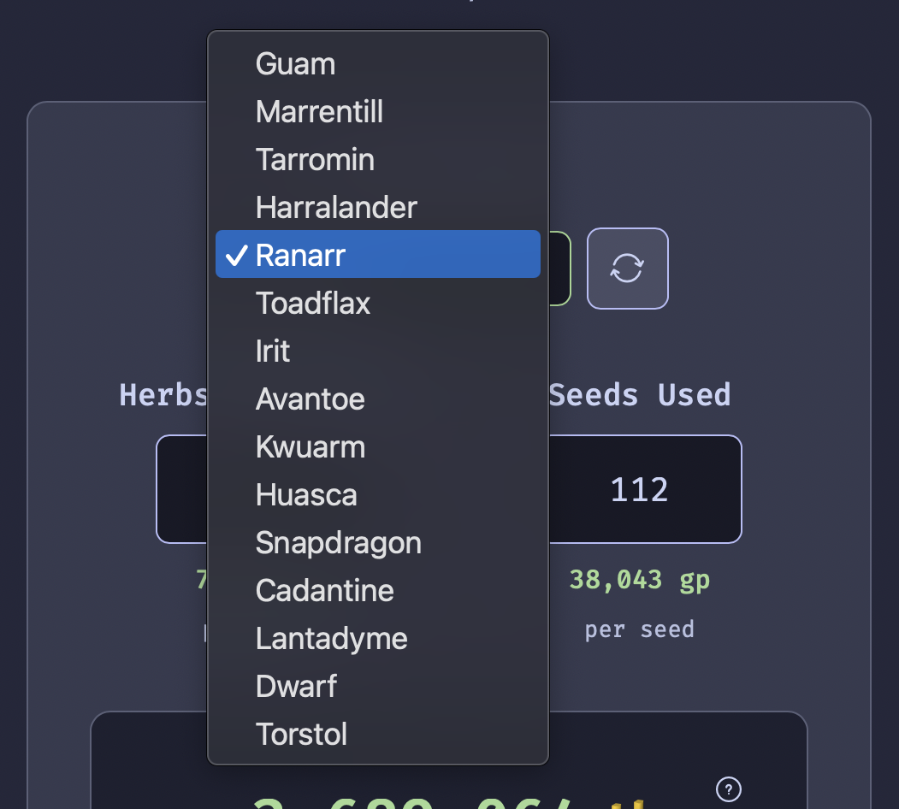

  

# Herb Buddy
OSRS herb run profit calculator with live GE prices

## How it works
Live GE prices are pulled from the wiki when you load the page, and are cached in the background.

Input the amount of seeds you used, and how many herbs you harvested, to calculate your total profit.

The following formula is used: `Profit = (Price of Herb * Herbs Harvested) - (Price of Seed * Number of Seeds)`

You can change the herb type by using the dropdown:

